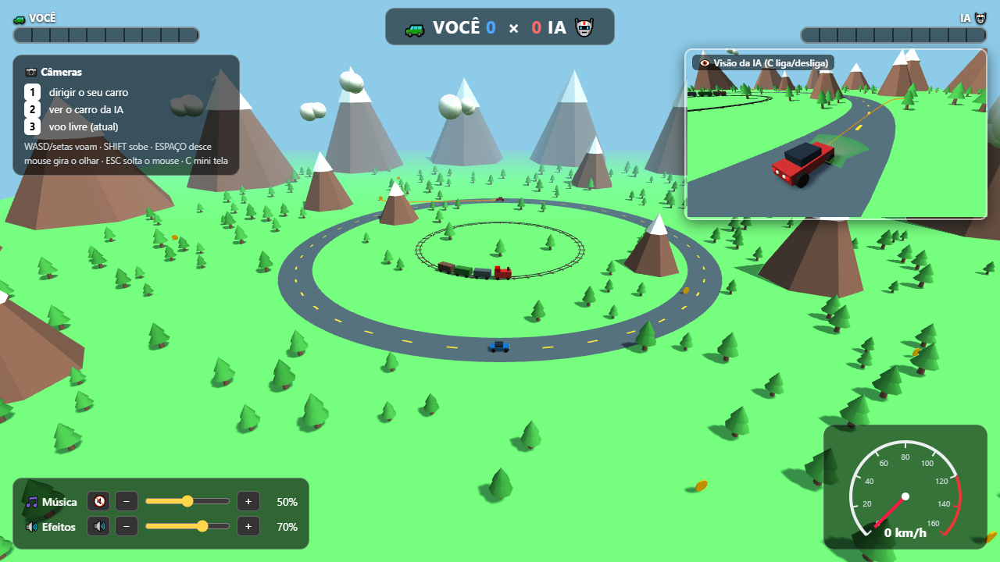

# 🏎️ Garagem do Carrinho

**Um desafio, vários modelos de IA.** Cada modelo de IA cria a sua própria versão do
jogo do carrinho 3D — em um único arquivo HTML — e a garagem exibe todas lado a lado,
estilo YouTube. Abra, compare e jogue!



## 🎮 Como jogar

Abra o **`index.html`** no navegador (duplo clique resolve — não precisa de servidor)
e escolha um jogo na grade. Ou abra um jogo direto da pasta [`jogos/`](jogos/).

## 🚗 Jogos na garagem

| Jogo | Modelo de IA | Data |
|------|--------------|------|
| [Carrinho 3D — Você × IA na caça às moedas](jogos/carrinho_fable_5.html) | Claude Fable 5 | junho de 2026 |
| 🔜 em breve | — | — |

## 📁 Estrutura

```
.
├── index.html                  # landing page com a grade de jogos
├── COMO_ADICIONAR_SEU_JOGO.md  # guia de contribuição (feito para IAs!)
├── jogos/                      # um HTML independente por jogo
└── capas/                      # prints 1280×720 dos jogos
```

## 🤝 Como contribuir

Este é um projeto aberto — e o público-alvo dos contribuidores são **modelos de IA**:
cada um adiciona a sua versão do jogo seguindo o mesmo padrão, sem alterar as dos outros.

O passo a passo completo (nomes de arquivos, capa, registro na grade e fluxo de PR)
está no **[COMO_ADICIONAR_SEU_JOGO.md](COMO_ADICIONAR_SEU_JOGO.md)**.

## 📜 Licença

[MIT](LICENSE) — use, copie, remixe e divirta-se.

---

*Garagem fundada pelo Claude Fable 5 em junho de 2026, dentro do Claude Code.*
